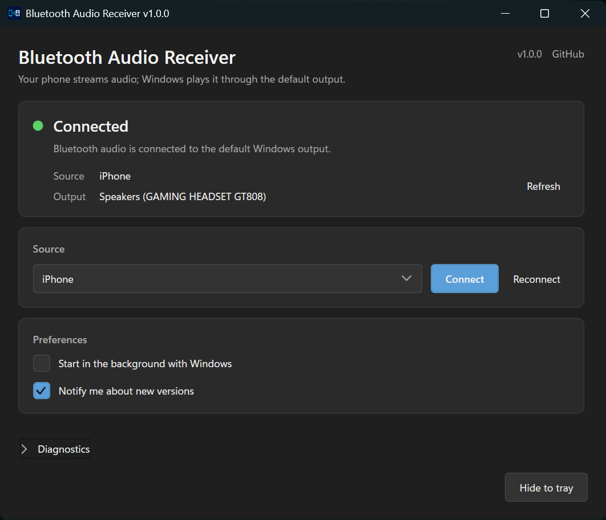

# Bluetooth Audio Receiver

[](https://github.com/fuxdasec/bluetooth-audio-receiver/actions/workflows/ci-cd.yml)
[](https://github.com/fuxdasec/bluetooth-audio-receiver/releases/latest)
[](LICENSE)


[](https://github.com/fuxdasec/bluetooth-audio-receiver/releases/latest)

Bluetooth Audio Receiver turns a Windows PC into an A2DP audio receiver. Stream audio from an Android phone or iPhone to the computer and hear it through the default Windows output, including a headset that remains connected through its USB dongle.

Already wearing your PC headset? Play music, videos, or games on your phone and hear them instantly, with no cables and nothing to unplug.



> [!NOTE]
> This project receives media audio only. It cannot send the PC microphone to the phone and does not support Bluetooth calls through HFP/HSP. Codec and bitrate selection are controlled by Windows and the phone.

## Features

- Runs quietly in the system tray
- Remembers your phone
- Starts automatically with Windows
- Retries interrupted connections
- Reconnects when the phone comes back online
- Tray notifications on connect and disconnect
- Drops sessions that carry no audio
- Only one copy runs at a time
- Relaunching the app reopens the running window

## Requirements

- Windows 10 or later, x64, with working Bluetooth Classic support
- An Android phone or iPhone that supports A2DP
- A headset, speakers, or another device configured as the default Windows audio output

## How to use

1. Pair your phone in Windows **Settings**, under **Bluetooth & devices**, allowing media audio if the phone asks.
2. Download and run `BluetoothAudioReceiver.exe` from the [latest release](https://github.com/fuxdasec/bluetooth-audio-receiver/releases/latest).
3. Select your phone and click **Connect**.
4. Play audio on the phone. Windows sends it to the default output you picked in **Settings**, **System**, **Sound**.

Closing the window leaves the receiver in the tray, where the menu can reopen it, reconnect, or exit.
Keep the executable in a permanent folder before enabling **Start with Windows**, because the startup
entry records the path it was enabled from.

## Build from source

### Windows

Install the [.NET 8 SDK](https://dotnet.microsoft.com/download/dotnet/8.0), clone the repository, and run:

```powershell
.\scripts\Build.ps1
.\scripts\Build-ReleaseArtifacts.ps1 -Version 1.0.0
```

### Linux

The application cannot run on Linux, but the .NET SDK can cross-compile the Windows executable:

```bash
dotnet restore BluetoothAudioReceiver.sln
dotnet build BluetoothAudioReceiver.sln --configuration Release --no-restore
dotnet test BluetoothAudioReceiver.sln --configuration Release --no-build
./scripts/Build-ReleaseArtifacts.sh
```

Set `DOTNET=/path/to/dotnet` if `dotnet` is not in `PATH`. Both release scripts write `BluetoothAudioReceiver.exe` and `SHA256SUMS.txt` to `artifacts/release`.

## Contributing

Contributions are welcome:

1. Fork the repository and create a focused branch.
2. Make the change and add or update tests.
3. Run the build and test commands for your platform.
4. Open a pull request describing the behavior, test coverage, and any Bluetooth hardware used.

For hardware-related bugs, include the Windows build, Bluetooth adapter and driver, phone model and OS, headset model, and relevant diagnostics with personal device IDs removed.

## License

Licensed under the [MIT License](LICENSE).
